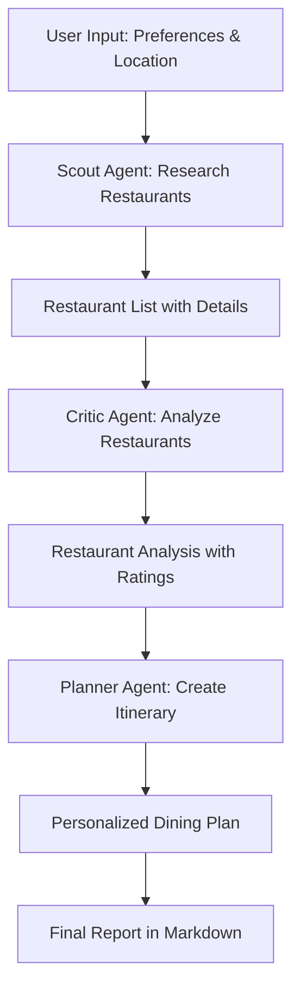

# FoodCatalyst Crew

[](https://crewai.com)
[](https://opensource.org/licenses/MIT)

Welcome to FoodCatalyst Crew, an AI-powered restaurant discovery and planning system built with [crewAI](https://crewai.com). This project uses multiple AI agents working together to research, analyze, and create personalized dining itineraries based on your preferences.

## 🍽️ Project Overview

StoryCatalyst transforms how you discover and plan dining experiences by leveraging specialized AI agents that:
1. Research trending and highly-rated restaurants in your area
2. Analyze restaurant details to provide comprehensive insights
3. Create personalized dining itineraries based on your preferences

Whether you're a local looking for new dining experiences or a traveler seeking the best local cuisine, StoryCatalyst creates tailored restaurant recommendations that match your taste.

## 🤖 Agents

Our system consists of three specialized AI agents working in sequence:

1. **Scout (Web-Savvy Restaurant Finder)**
   - Discovers highly-rated and trending restaurants in your area
   - Gathers key details like ratings, cuisine type, and location highlights

2. **Critic (Food Review Analyst)**
   - Analyzes restaurant reviews, menus, and customer feedback
   - Provides balanced assessments highlighting strengths and weaknesses

3. **Planner (Dining Itinerary Builder)**
   - Creates personalized dining plans based on research and analysis
   - Organizes recommendations into a clear, enjoyable dining experience

## 📋 Workflow



## 🚀 Installation

Ensure you have Python >=3.10 <3.14 installed on your system. This project uses [UV](https://docs.astral.sh/uv/) for dependency management.

First, if you haven't already, install uv:

```bash
pip install uv
```

Next, navigate to your project directory and install the dependencies:

```bash
crewai install
```

### Environment Setup

Create a `.env` file in the project root with your API keys:

```env
OPENAI_API_KEY=your_openai_api_key_here
SERPER_API_KEY=your_serper_api_key_here
```

## ▶️ Running the Project

To run the StoryCatalyst Crew:

```bash
crewai run
```

This will execute the agents in sequence and generate a `report.md` file with your personalized dining itinerary.

### Customizing Inputs

Modify the inputs in `src/story_catalyst/main.py` to customize your search:

```python
inputs = {
    'topic': 'Italian cuisine',        # Type of cuisine or dining preference
    'location': 'New York',            # City or area for restaurant search
    'current_year': str(datetime.now().year)
}
```

## 📁 Project Structure

```
story_catalyst/
├── src/
│   └── story_catalyst/
│       ├── config/
│       │   ├── agents.yaml         # Agent definitions
│       │   └── tasks.yaml          # Task definitions
│       ├── tools/
│       │   ├── custom_tool.py      # Custom tools (if any)
│       │   └── html_generator.py   # HTML report generator tool
│       ├── crew.py                 # Main crew definition
│       └── main.py                 # Entry point
├── knowledge/
│   └── user_preference.txt         # User preference data
├── report.md                       # Generated output (after run)
├── report.html                     # HTML generated output (after run)
├── .env                            # API keys (not in version control)
├── pyproject.toml                  # Project dependencies
└── README.md
```

## ⚙️ Configuration

### Agents
Modify `src/story_catalyst/config/agents.yaml` to customize agent roles, goals, and backstories.

### Tasks
Modify `src/story_catalyst/config/tasks.yaml` to adjust task descriptions and expected outputs.

### Custom Tools
Add custom tools in `src/story_catalyst/tools/` and register them in your agents.

The project includes a custom HTML generator tool (`html_generator.py`) that creates visually appealing HTML reports from the JSON output of the planning agent.

## 🛠️ Customization

To customize the StoryCatalyst Crew for your specific needs:

1. Modify agent configurations in `src/story_catalyst/config/agents.yaml`
2. Adjust task parameters in `src/story_catalyst/config/tasks.yaml`
3. Add custom logic in `src/story_catalyst/crew.py`
4. Change input parameters in `src/story_catalyst/main.py`

## 📊 Output

After running, the crew generates two files:
1. `report.md` - A markdown report containing:
   - A list of recommended restaurants with key details
   - Analysis of each restaurant with pros and cons
   - A personalized dining itinerary with scheduling suggestions

2. `report.html` - An HTML report with the same information in a visually appealing format with styling

## 🤝 Support

For support, questions, or feedback regarding StoryCatalyst or crewAI:
- Visit the [crewAI documentation](https://docs.crewai.com)
- Check the [crewAI GitHub repository](https://github.com/joaomdmoura/crewai)
- [Join the crewAI Discord](https://discord.com/invite/X4JWnZnxPb)
- [Chat with the docs](https://chatg.pt/DWjSBZn)

## 📄 License

This project is licensed under the MIT License - see the LICENSE file for details.

Let's create amazing dining experiences together with the power of AI agents!